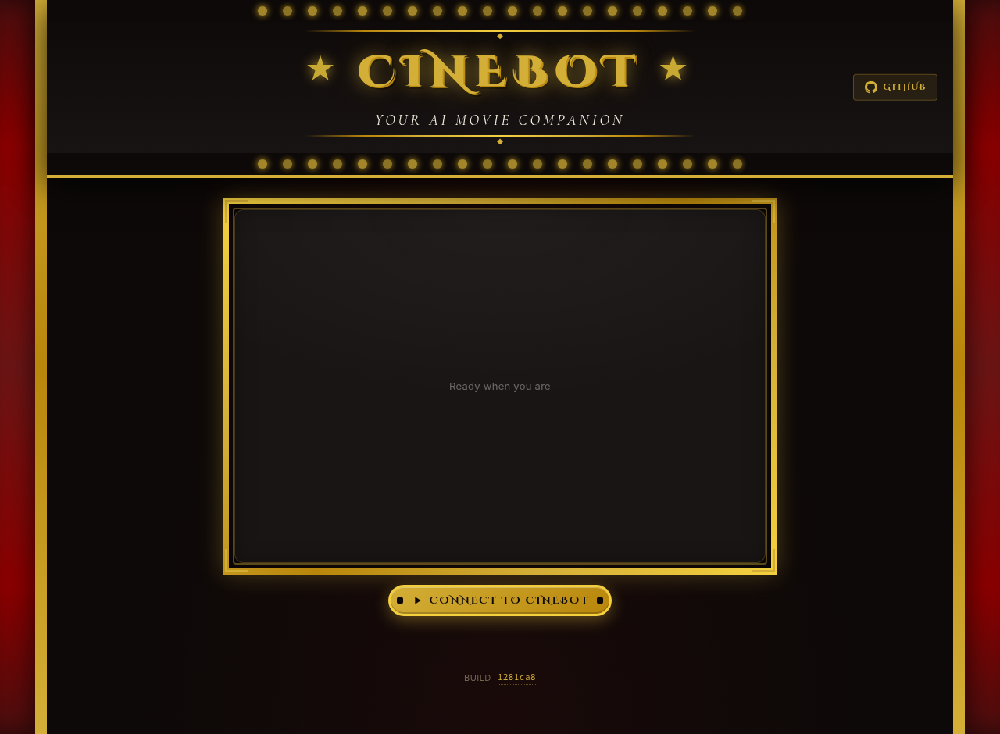

# CineBot - Your AI Movie Companion 🎬

CineBot is an intelligent voice-driven movie discovery assistant powered by SignalWire AI Agents and The Movie Database (TMDB). Have natural conversations to explore movies, actors, and get personalized recommendations, presented in an Old Hollywood picture-house interface.

DEMO https://cinebot.signalwire.io/

<p align="center">
  
</p>

## Features

### 🎙️ Voice-First Interaction
- **Natural Language Understanding**: Talk to CineBot like you would a movie-loving friend
- **Real-time Voice Response**: Get instant spoken responses with ElevenLabs voice synthesis
- **Video Presence**: See CineBot's animated avatar during conversations
- **Context-Aware Conversations**: CineBot remembers what you're discussing and maintains context

### 🎬 Movie Discovery
- **Smart Search**: Search movies by title with automatic year filtering
  - "Show me Pretty Woman from 1990"
  - "Find Top Gun from 1986"
- **Trending Movies**: Discover what's popular this week or today
- **Genre Browsing**: Explore movies by genre (action, comedy, horror, drama, sci-fi, romance)
- **Personalized Recommendations**: Get similar movie suggestions based on what you're viewing
- **Detailed Information**: 
  - Cast and crew details with photos
  - Plot summaries and taglines
  - Release dates and runtimes
  - User ratings from TMDB
  - Content ratings (G, PG, PG-13, R, NC-17)
  - Streaming availability (Netflix, Amazon Prime, Disney+, etc.)

### 👥 Person Discovery
- **Actor/Director Search**: Find information about actors, directors, and crew
- **Complete Filmographies**: Browse all movies a person has worked on
- **Biography Information**: Learn about the person's background
- **Known For**: See their most popular works
- **Visual Profiles**: High-quality photos and headshots

### 🎯 Smart Features
- **ID-Based Selection**: CineBot uses movie and person IDs for precise selection
- **Multi-Result Handling**: When multiple matches are found, CineBot presents options
- **Watchlist Management**: Add movies to your personal watchlist
- **Automatic Trailers**: Watch trailers directly in the interface; CineBot holds
  and goes quiet for the length of the video, and picks up when you close it
- **Visual Placeholders**: Elegant placeholders for missing images

### 🎨 Visual Interface
- **Two themes, switchable in the header** — the choice is remembered:
  - **Old Hollywood**: marquee lights, art-deco detailing and a gilded frame
    around the agent, over a dark picture-house backdrop
  - **Streaming**: the poster-first look of a streaming service — near-black
    ground, a single red accent, tight bold type, and artwork that lifts on
    hover
- **Responsive Layouts**: Adapts to different screen sizes
- **Rich Media Display**:
  - High-quality movie posters
  - Backdrop images with gradient overlays
  - Cast photo carousels
  - Streaming provider logos
- **Smart Positioning**: Agent video moves to corner when displaying content
- **Clean Transitions**: Smooth animations and display clearing between views

## Technical Architecture

### Backend (Python)
- **SignalWire AI Agents SDK**: Core framework for voice AI capabilities
- **TMDB Integration**: Complete movie database access via tmdbsimple
- **Redis Caching**: Fast response times with intelligent caching
- **State Management**: Context-aware conversation flow with state machines
- **SWAIG Functions**: Specialized functions for movie operations
- **Event System**: One-way event flow from backend to frontend

### Frontend (JavaScript)
- **WebRTC Video/Audio**: Real-time communication with SignalWire
- **Dynamic UI Updates**: Event-driven interface updates
- **Responsive Design**: Mobile-friendly layouts
- **Modern CSS**: Custom properties, animations, and gradients

## Installation

### Prerequisites
- Python 3.11 (see `runtime.txt`)
- Redis server (optional, for caching)
- TMDB API key (get one at https://www.themoviedb.org/settings/api)
- SignalWire account — space, project ID and API token

### Setup

1. **Clone the repository**
```bash
git clone https://github.com/signalwire-demos/cinebot.git
cd cinebot
```

2. **Create virtual environment**
```bash
python -m venv venv
source venv/bin/activate  # On Windows: venv\Scripts\activate
```

3. **Install dependencies**
```bash
pip install -r requirements.txt
```

4. **Set environment variables**
```bash
export TMDB_API_KEY="your_tmdb_api_key"
export SIGNALWIRE_SPACE_NAME="yourspace.signalwire.com"
export SIGNALWIRE_PROJECT_ID="your_project_id"
export SIGNALWIRE_TOKEN="your_api_token"
export SWML_PROXY_URL_BASE="https://your-public-hostname"  # how the platform reaches you
export REDIS_URL="redis://localhost:6379/0"  # Optional
export PORT=3030  # Optional, defaults to 3030
```

See `.env.example` for the full list.

5. **Run the application**
```bash
python app.py
```

6. **Access the interface**
Open your browser to `http://localhost:3030`

## Usage

### Starting a Session
1. Click "Connect to CineBot" button
2. Allow microphone and camera permissions
3. Start talking to CineBot!

### Example Conversations

**Finding Movies:**
- "Show me trending movies"
- "Search for Pretty Woman from 1990"
- "Find action movies"
- "What movies are similar to Top Gun?"

**Getting Details:**
- "Tell me about the first one"
- "Show me more details"
- "Who's in the cast?"
- "Where can I watch this?"

**Exploring People:**
- "Search for Tom Cruise"
- "Show me movies with Julia Roberts"
- "Tell me about the director"

**Navigation:**
- "Go back to trending"
- "Clear the display"
- "Show me something else"

### Voice Commands Structure

CineBot understands natural language, so speak naturally! The system recognizes:
- **Direct requests**: "Show me Star Wars"
- **Contextual references**: "Tell me about the second one"
- **Follow-up questions**: "Who directed it?"
- **Navigation**: "Go back", "Show trending again"

## API Functions

### Core SWAIG Functions

| Function | Description | Parameters |
|----------|-------------|------------|
| `search_movie` | Search for movies by title | `query` (with optional year) |
| `get_movie_details` | Get detailed movie information | `movie_id`, `movie_title`, or `search_position` |
| `get_cast_crew` | Cast and crew for the current title | None |
| `get_similar_content` | Similar movies or shows | `content_type`, `content_id` |
| `get_videos` | Trailers and clips; plays one on screen | `content_type`, `content_id`, `video_type` |
| `get_now_playing` | Movies currently in theatres | `region` |
| `search_tv` | Search for TV shows | `query` |
| `get_tv_details` | Detailed show information | `tv_id`, `tv_title`, or `search_position` |
| `get_season_details` | Episodes for one season | `season_number` |
| `get_trending_tv` | Trending TV shows | `time_window` (day/week) |
| `search_person` | Search for actors/directors | `query`, `person_id`, or `search_position` |
| `get_trending` | Get trending movies | `time_window` (day/week) |
| `get_movies_by_genre` | Browse by genre | `genre_name` |
| `discover_content` | Browse by combined filters | genre, year, rating, sort |
| `multi_search` | Search movies, shows and people at once | `query` |
| `add_to_watchlist` | Add movie to watchlist | `movie_id` |
| `clear_display` | Clear the current display | None |

### HTTP Endpoints

| Endpoint | Description |
|----------|-------------|
| `GET /api/version` | Commit this instance is running; drives the page footer |
| `GET /api/menu` | Available genres |
| `GET /api/watchlist?call_id=` | One caller's watchlist — scoped, not global |
| `GET /get_token` | Guest token and dialable address for the browser |
| `POST /trailer/hold` | Hold the AI for the length of a trailer |
| `POST /trailer/unhold` | Release it when the viewer closes the trailer |

`/trailer/*` accept only call ids this agent has served a trailer to.

### Event Types

Events flow one-way from backend to frontend:

| Event | Description | Data |
|-------|-------------|------|
| `movie_search_results` | Movie search results | TMDB search results |
| `movie_details` | Detailed movie info | Movie details + cast + providers |
| `cast_crew_display` | Cast and crew | Credits for the current title |
| `now_playing` | In theatres now | TMDB now-playing results |
| `tv_search_results` | TV search results | TMDB TV results |
| `tv_details` | Detailed show info | Show details + cast |
| `season_details` | Episodes for a season | Season + episode list |
| `trending_tv` | Trending shows | TMDB trending TV |
| `person_details` | Person information | Person details + filmography |
| `person_search_results` | Person search results | TMDB person results |
| `multi_search_results` | Mixed search results | Movies, shows and people |
| `trending_movies` | Trending movies list | TMDB trending results |
| `genre_movies` | Movies by genre | Genre name + movies |
| `video_available` | One trailer, played on screen | Video + all videos |
| `videos_available` | Several videos to choose from | Video list |
| `watchlist_updated` | Watchlist changed | Current watchlist |
| `clear_display` | Clear all displays | Empty |

## Configuration

### Environment Variables

| Variable | Description | Default |
|----------|-------------|---------|
| `TMDB_API_KEY` | TMDB API key (required) | None |
| `REDIS_URL` | Redis connection URL | `redis://localhost:6379/0` |
| `REDIS_TTL` | Cache TTL in seconds | `3600` |
| `PORT` | Server port | `3030` |
| `HOST` | Server host | `0.0.0.0` |
| `SWML_BASIC_AUTH_USER` | Basic auth username | Auto-generated |
| `SWML_BASIC_AUTH_PASSWORD` | Basic auth password | Auto-generated |

### Customization

**Voice Settings** (in `app.py`):
```python
self.add_language(
    name="English",
    code="en-US", 
    voice="elevenlabs.adam"  # Change voice here
)
```

**UI Theme** (in `web/styles.css`):
- CSS custom properties for colors
- Easily customizable gradients and animations
- Responsive breakpoints

## State Management

CineBot uses a state machine with four main states:

1. **greeting**: Initial state, ready for first request
2. **browsing**: Viewing search results or lists
3. **movie_details**: Viewing specific movie information
4. **person_details**: Viewing person information

Each state has specific allowed functions and valid transitions.

## Development

### Project Structure
```
cinebot/
├── app.py                   # Agent, SWAIG functions and HTTP routes
├── tmdb_client.py           # TMDB API client with caching
├── requirements.txt         # Python dependencies
├── runtime.txt              # Python version for buildpack hosts
├── Procfile                 # Start command (one worker)
├── app.json                 # Environment contract
├── bin/
│   └── post_compile         # Records the deployed commit at build time
├── web/
│   ├── index.html           # Main HTML interface
│   ├── app.js               # Frontend JavaScript
│   ├── styles.css           # CSS styles
│   ├── silence.mp3          # Hold audio, so nothing plays over a trailer
│   ├── background.png       # Backdrop
│   ├── cinebot_idle.mp4     # Agent idle animation
│   └── cinebot_talking.mp4  # Agent talking animation
├── docs/
│   └── screenshot.png       # README screenshot
└── README.md                # This file
```

### Adding New Features

1. **New SWAIG Function**: Add to `_setup_functions()` in `app.py`
2. **New Event Type**: Add handler in `handleAgentEvent()` in `app.js`
3. **New Display Mode**: Create display function in `app.js`
4. **New State**: Add to state machine in `app.py`

### Testing
```bash
# Run with debug logging
python app.py

# Test TMDB connection
python -c "from tmdb_client import TMDBClient; client = TMDBClient(); print(client.search_movie('Star Wars'))"

# Monitor Redis cache
redis-cli MONITOR
```

## Deployment

### SignalWire Deployment

1. Set up SignalWire account
2. Configure environment variables
3. Deploy to SignalWire-compatible hosting
4. Update webhook URLs in SignalWire dashboard

### Buildpack / Dokku

The hosted demo at https://cinebot.signalwire.io/ runs this way. `Procfile`,
`runtime.txt` and `app.json` are all a buildpack host needs; `bin/post_compile`
records the deployed commit so `/api/version` can report it.

```bash
git push dokku main
```

### Docker

For self-hosting. There is no Dockerfile in the repo — the image is a few lines:

```dockerfile
FROM python:3.11-slim
WORKDIR /app

COPY requirements.txt .
RUN pip install --no-cache-dir -r requirements.txt
COPY . .

ENV PORT=3030
EXPOSE 3030

# Same command as the Procfile. app:app is the FastAPI app created in app.py.
CMD ["sh", "-c", "gunicorn app:app --bind 0.0.0.0:${PORT} --workers 1 --worker-class uvicorn.workers.UvicornWorker"]
```

Pass the environment from `.env.example`, and set `GIT_COMMIT` at build time if
you want the footer to name your build.

### Run a single worker

Whichever way you deploy, keep it to **one worker** — the `Procfile` and the
command above both do. Conversation state (search results, the current title,
the watchlist) is held per call inside the process, so a second worker would
serve a caller's next tool call from a process that has never seen their
session.

## Troubleshooting

### Common Issues

**"401 Unauthorized" errors**
- Check basic auth credentials in startup logs
- Verify SignalWire configuration

**No movies displaying**
- Check browser console for JavaScript errors
- Verify TMDB API key is valid
- Check Redis connection

**Voice not working**
- Ensure microphone permissions granted
- Check WebRTC connection in browser console
- Verify SignalWire credentials

**Display not clearing properly**
- Hard refresh browser (Ctrl+Shift+R)
- Check for JavaScript errors
- Verify event handlers are registered

## Key Improvements Made

### Year-Based Search
- Automatically parses year from queries like "Pretty Woman from 1990"
- Filters results to match the specified year
- Provides clear feedback when movies from specific years aren't found

### ID Exposure for AI
- All search results now include movie/person IDs in the response text
- Format: `"id: 114 title: 'Pretty Woman' (1990)"`
- Enables precise selection without ambiguity

### Display Management
- All display functions properly clear previous content
- Prevents overlapping or stuck displays
- Smooth transitions between different views

### Authentication
- Proper basic auth setup with auto-generated credentials
- Credentials displayed on startup for easy access
- Secure WebRTC communication

## Contributing

Contributions are welcome! Please:
1. Fork the repository
2. Create a feature branch
3. Make your changes
4. Test thoroughly
5. Submit a pull request

## License

MIT License - See LICENSE file for details

## Credits

- **SignalWire** - AI Agent platform and WebRTC infrastructure
- **The Movie Database (TMDB)** - Movie data and images
- **ElevenLabs** - Voice synthesis
- **Redis** - Caching layer
- **Holy Guacamole** - Architecture inspiration

## Support

For issues, questions, or suggestions:
- Open an issue on GitHub
- Contact the development team
- Check the SignalWire documentation

---

Built with ❤️ for movie lovers everywhere
